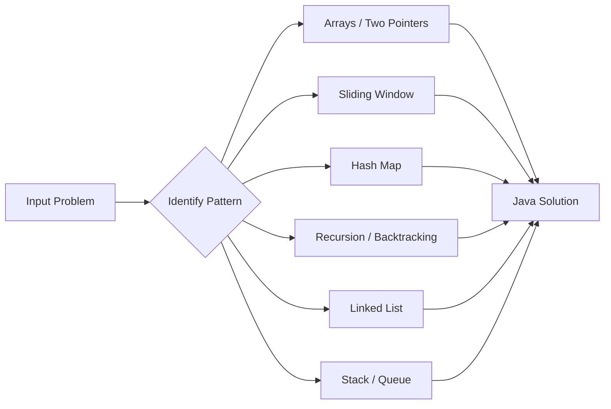

<div align="center">

# DSA

[](https://openjdk.org/)
[](https://github.com/UBX-CODE/DSA)
[](https://leetcode.com/u/UBX0/)
[]()

**A curated collection of Data Structures & Algorithms solutions in Java**

Clean implementations, pattern-driven thinking, and interview-ready code — organized by topic for fast revision.

[Problem Index](#-problem-index) · [Patterns](#-pattern-practice) · [Getting Started](#-getting-started) · [Topics](#-topics-covered)

</div>

---

## About

This repository is my personal **DSA practice vault** — a growing library of Java solutions spanning arrays, strings, linked lists, recursion, stacks, binary search, and classic pattern problems.

Each solution is written to be **readable first**: straightforward logic, minimal abstraction, and comments where the approach isn't obvious. Problems are grouped by topic so you can drill a single pattern end-to-end.

> **Repo:** [github.com/UBX-CODE/DSA](https://github.com/UBX-CODE/DSA)

---

## Repository Structure

```
DSA/
├── Arrays/           # Array, matrix, two-pointer & sliding window problems
├── Strings/          # String manipulation, hashing & window techniques
├── LinkedList/       # Singly linked list classic problems
├── Recursion/        # Backtracking, subsets, combinations & stack recursion
├── StackQueue/       # Stack-based design problems
└── patterns/         # Star & pyramid pattern practice (01–24)
```



---

## Stats

| Category | Solutions | Focus Area |
|:---------|:---------:|:-----------|
| Arrays | 46 | Two pointers, prefix sum, sorting, matrices |
| Strings | 13 | Hashing, sliding window, stack parsing |
| Linked List | 10 | Fast/slow pointers, reversal, merging |
| Recursion | 11 | Subsets, combinations, grid DFS & backtracking |
| Patterns | 24 | Loop & nested-loop fundamentals |
| Stack + Queue | 5 | Monotonic stack, min stack design, parenthese matching |
| **Total** | **109** | |

---

## Problem Index

### Arrays

<details>
<summary><strong>46 problems</strong> — click to expand</summary>

| Problem | LC # | File |
|:--------|:----:|:-----|
| Two Sum | [1](https://leetcode.com/problems/two-sum/) | [`TwoSum.java`](Arrays/TwoSum.java) |
| Best Time to Buy and Sell Stock | [121](https://leetcode.com/problems/best-time-to-buy-and-sell-stock/) | [`BestTimeToBuyAndSellStock.java`](Arrays/BestTimeToBuyAndSellStock.java) |
| Longest Palindromic Substring | [5](https://leetcode.com/problems/longest-palindromic-substring/) | [`LongestPalindromicSubstring.java`](Arrays/LongestPalindromicSubstring.java) |
| Container With Most Water | [11](https://leetcode.com/problems/container-with-most-water/) | [`ContainerWithMostWater.java`](Arrays/ContainerWithMostWater.java) |
| 3Sum | [15](https://leetcode.com/problems/3sum/) | [`ThreeSum.java`](Arrays/ThreeSum.java) |
| 4Sum | [18](https://leetcode.com/problems/4sum/) | [`FourSum.java`](Arrays/FourSum.java) |
| Next Permutation | [31](https://leetcode.com/problems/next-permutation/) | [`NextPermutation.java`](Arrays/NextPermutation.java) |
| First Missing Positive | [41](https://leetcode.com/problems/first-missing-positive/) | [`FirstMissingPositive.java`](Arrays/FirstMissingPositive.java) |
| Trapping Rain Water | [42](https://leetcode.com/problems/trapping-rain-water/) | [`TrappingRainWater.java`](Arrays/TrappingRainWater.java) |
| Maximum Subarray | [53](https://leetcode.com/problems/maximum-subarray/) | [`MaxSubarray.java`](Arrays/MaxSubarray.java) |
| Insert Interval | [57](https://leetcode.com/problems/insert-interval/) | [`InsertIntervals.java`](Arrays/InsertIntervals.java) |
| Spiral Matrix | [54](https://leetcode.com/problems/spiral-matrix/) | [`SpiralMatrix.java`](Arrays/SpiralMatrix.java) |
| Jump Game | [55](https://leetcode.com/problems/jump-game/) | [`JumpGame.java`](Arrays/JumpGame.java) |
| Jump Game II | [45](https://leetcode.com/problems/jump-game-ii/) | [`JumpGame2.java`](Arrays/JumpGame2.java) |
| Rotate Matrix | [48](https://leetcode.com/problems/rotate-image/) | [`RotateMatrix.java`](Arrays/RotateMatrix.java) |
| Group Anagrams | [49](https://leetcode.com/problems/group-anagrams/) | [`GroupAnagrams.java`](Arrays/GroupAnagrams.java) |
| Maximum Product Subarray | [152](https://leetcode.com/problems/maximum-product-subarray/) | [`MaximumProductSubarray.java`](Arrays/MaximumProductSubarray.java) |
| Search in Rotated Sorted Array | [33](https://leetcode.com/problems/search-in-rotated-sorted-array/) | [`SearchInRotatedSorted.java`](Arrays/SearchInRotatedSorted.java) |
| Find Minimum in Rotated Sorted Array | [153](https://leetcode.com/problems/find-minimum-in-rotated-sorted-array/) | [`FindMinimunInRotated.java`](Arrays/FindMinimunInRotated.java) |
| Find Peak Element | [162](https://leetcode.com/problems/find-peak-element/) | [`FindPeakElement.java`](Arrays/FindPeakElement.java) |
| Majority Element | [169](https://leetcode.com/problems/majority-element/) | [`MajorityElement.java`](Arrays/MajorityElement.java) |
| Majority Element II | [229](https://leetcode.com/problems/majority-element-ii/) | [`MajorityElements.java`](Arrays/MajorityElements.java) |
| Kth Largest Element in an Array | [215](https://leetcode.com/problems/kth-largest-element-in-an-array/) | [`FindKthLargest.java`](Arrays/FindKthLargest.java) |
| Product of Array Except Self | [238](https://leetcode.com/problems/product-of-array-except-self/) | [`ProductExceptSelf.java`](Arrays/ProductExceptSelf.java) |
| Sliding Window Maximum | [239](https://leetcode.com/problems/sliding-window-maximum/) | [`SlidingWindowMaximum.java`](Arrays/SlidingWindowMaximum.java) |
| Single Number | [136](https://leetcode.com/problems/single-number/) | [`SingleNumber.java`](Arrays/SingleNumber.java) |
| Gas Station | [134](https://leetcode.com/problems/gas-station/) | [`GasStation.java`](Arrays/GasStation.java) |
| Largest Rectangle in Histogram | [84](https://leetcode.com/problems/largest-rectangle-in-histogram/) | [`LargestRectangle.java`](Arrays/LargestRectangle.java) |
| Longest Consecutive Sequence | [128](https://leetcode.com/problems/longest-consecutive-sequence/) | [`LongestConsecutive.java`](Arrays/LongestConsecutive.java) |
| Valid Palindrome | [125](https://leetcode.com/problems/valid-palindrome/) | [`ValidPalindrome.java`](Arrays/ValidPalindrome.java) |
| Remove Duplicates from Sorted Array | [26](https://leetcode.com/problems/remove-duplicates-from-sorted-array/) | [`RemoveDuplicates.java`](Arrays/RemoveDuplicates.java) |
| Move Zeroes | [283](https://leetcode.com/problems/move-zeroes/) | [`MoveZeros.java`](Arrays/MoveZeros.java) |
| Sort Colors | [75](https://leetcode.com/problems/sort-colors/) | [`SortColor.java`](Arrays/SortColor.java) |
| Merge Sorted Array | [88](https://leetcode.com/problems/merge-sorted-array/) | [`MergeSortedArray.java`](Arrays/MergeSortedArray.java) |
| Set Matrix Zeroes | [73](https://leetcode.com/problems/set-matrix-zeroes/) | [`SetMatrixZeros.java`](Arrays/SetMatrixZeros.java) |
| Rotate Array | [189](https://leetcode.com/problems/rotate-array/) | [`RotateArray.java`](Arrays/RotateArray.java) |
| Subarray Sum Equals K | [560](https://leetcode.com/problems/subarray-sum-equals-k/) | [`SubarraySumEqualsK.java`](Arrays/SubarraySumEqualsK.java) |
| Partition Labels | [763](https://leetcode.com/problems/partition-labels/) | [`PartitionLabels.java`](Arrays/PartitionLabels.java) |
| Find All Numbers Disappeared in an Array | [448](https://leetcode.com/problems/find-all-numbers-disappeared-in-an-array/) | [`AllNumbersDisappeared.java`](Arrays/AllNumbersDisappeared.java) |
| Find All Duplicates in an Array | [442](https://leetcode.com/problems/find-all-duplicates-in-an-array/) | [`FindDuplicates.java`](Arrays/FindDuplicates.java) |
| Intersection of Two Arrays | [349](https://leetcode.com/problems/intersection-of-two-arrays/) | [`IntersectionOfTwoArrays.java`](Arrays/IntersectionOfTwoArrays.java) |
| Rearrange Array Elements by Sign | [2149](https://leetcode.com/problems/rearrange-array-elements-by-sign/) | [`RearrangeBySign.java`](Arrays/RearrangeBySign.java) |
| Maximum Sum Circular Subarray | [918](https://leetcode.com/problems/maximum-sum-circular-subarray/) | [`MaximumSumCircularSubarray.java`](Arrays/MaximumSumCircularSubarray.java) |
| Check if Array Is Sorted and Rotated | [1752](https://leetcode.com/problems/check-if-array-is-sorted-and-rotated/) | [`SortedAndRotated.java`](Arrays/SortedAndRotated.java) |
| Longest Substring Without Repeating Characters | [3](https://leetcode.com/problems/longest-substring-without-repeating-characters/) | [`LongestSubstring.java`](Arrays/LongestSubstring.java) |
| Difference of Two Arrays | — | [`DifferenceOfArrays.java`](Arrays/DifferenceOfArrays.java) |

</details>

### Strings

<details>
<summary><strong>13 problems</strong> — click to expand</summary>

| Problem | LC # | File |
|:--------|:----:|:-----|
| Longest Substring Without Repeating Characters | [3](https://leetcode.com/problems/longest-substring-without-repeating-characters/) | [`LongestSubstringWithoutRepeating.java`](Strings/LongestSubstringWithoutRepeating.java) |
| Minimum Window Substring | [76](https://leetcode.com/problems/minimum-window-substring/) | [`MinWindowSubstring.java`](Strings/MinWindowSubstring.java) |
| Valid Parentheses | [20](https://leetcode.com/problems/valid-parentheses/) | [`ValidParentheses.java`](Strings/ValidParentheses.java) |
| Longest Common Prefix | [14](https://leetcode.com/problems/longest-common-prefix/) | [`LongestCommonPrefix.java`](Strings/LongestCommonPrefix.java) |
| Valid Anagram | [242](https://leetcode.com/problems/valid-anagram/) | [`ValidAnagram.java`](Strings/ValidAnagram.java) |
| Valid Palindrome | [125](https://leetcode.com/problems/valid-palindrome/) | [`ValidPalindrome.java`](Strings/ValidPalindrome.java) |
| Isomorphic Strings | [205](https://leetcode.com/problems/isomorphic-strings/) | [`IsomorphicString.java`](Strings/IsomorphicString.java) |
| Decode String | [394](https://leetcode.com/problems/decode-string/) | [`DecodeString.java`](Strings/DecodeString.java) |
| First Unique Character in a String | [387](https://leetcode.com/problems/first-unique-character-in-a-string/) | [`FirstUniqueCharacter.java`](Strings/FirstUniqueCharacter.java) |
| String Compression | [443](https://leetcode.com/problems/string-compression/) | [`StringCompression.java`](Strings/StringCompression.java) |
| Find All Anagrams in a String | [438](https://leetcode.com/problems/find-all-anagrams-in-a-string/) | [`FindAllAnagramsInAString.java`](Strings/FindAllAnagramsInAString.java) |
| Permutation in String | [567](https://leetcode.com/problems/permutation-in-string/) | [`PermutationInString.java`](Strings/PermutationInString.java) |
| Longest Repeating Character Replacement | [424](https://leetcode.com/problems/longest-repeating-character-replacement/) | [`LongestRepeatingCharReplacement.java`](Strings/LongestRepeatingCharReplacement.java) |

</details>

### Linked List

<details>
<summary><strong>10 problems</strong> — click to expand</summary>

| Problem | LC # | File |
|:--------|:----:|:-----|
| Add Two Numbers | [2](https://leetcode.com/problems/add-two-numbers/) | [`AddTwoNumbers.java`](LinkedList/AddTwoNumbers.java) |
| Remove Nth Node From End of List | [19](https://leetcode.com/problems/remove-nth-node-from-end-of-list/) | [`RemoveNthNodeFromEnd.java`](LinkedList/RemoveNthNodeFromEnd.java) |
| Merge Two Sorted Lists | [21](https://leetcode.com/problems/merge-two-sorted-lists/) | [`MergeTwoSortedList.java`](LinkedList/MergeTwoSortedList.java) |
| Reverse Linked List | [206](https://leetcode.com/problems/reverse-linked-list/) | [`ReverseLL.java`](LinkedList/ReverseLL.java) |
| Linked List Cycle | [141](https://leetcode.com/problems/linked-list-cycle/) | [`LLCycle.java`](LinkedList/LLCycle.java) |
| Reorder List | [143](https://leetcode.com/problems/reorder-list/) | [`ReorderList.java`](LinkedList/ReorderList.java) |
| Intersection of Two Linked Lists | [160](https://leetcode.com/problems/intersection-of-two-linked-lists/) | [`IntersectionLL.java`](LinkedList/IntersectionLL.java) |
| Palindrome Linked List | [234](https://leetcode.com/problems/palindrome-linked-list/) | [`PalindromeLL.java`](LinkedList/PalindromeLL.java) |
| Odd Even Linked List | [328](https://leetcode.com/problems/odd-even-linked-list/) | [`OddEvenLL.java`](LinkedList/OddEvenLL.java) |
| Middle of the Linked List | [876](https://leetcode.com/problems/middle-of-the-linked-list/) | [`MiddleOfLL.java`](LinkedList/MiddleOfLL.java) |

</details>

### Recursion & Backtracking

<details>
<summary><strong>11 problems</strong> — click to expand</summary>

| Problem | LC # | File |
|:--------|:----:|:-----|
| Letter Combinations of a Phone Number | [17](https://leetcode.com/problems/letter-combinations-of-a-phone-number/) | [`LetterCombination.java`](Recursion/LetterCombination.java) |
| Generate Parentheses | [22](https://leetcode.com/problems/generate-parentheses/) | [`GenerateParenthesis.java`](Recursion/GenerateParenthesis.java) |
| Combination Sum | [39](https://leetcode.com/problems/combination-sum/) | [`CombinationSum.java`](Recursion/CombinationSum.java) |
| Combination Sum II | [40](https://leetcode.com/problems/combination-sum-ii/) | [`CombinationSumII.java`](Recursion/CombinationSumII.java) |
| Pow(x, n) | [50](https://leetcode.com/problems/powx-n/) | [`PowXN.java`](Recursion/PowXN.java) |
| Subsets | [78](https://leetcode.com/problems/subsets/) | [`SubSets.java`](Recursion/SubSets.java) |
| Word Search | [79](https://leetcode.com/problems/word-search/) | [`WordSearch.java`](Recursion/WordSearch.java) |
| Subsets II | [90](https://leetcode.com/problems/subsets-ii/) | [`SubsetsII.java`](Recursion/SubsetsII.java) |
| Palindrome Partitioning | [131](https://leetcode.com/problems/palindrome-partitioning/) | [`PalindromePartitioning.java`](Recursion/PalindromePartitioning.java) |
| Reverse a Stack | — | [`ReverseStack.java`](Recursion/ReverseStack.java) |
| Sort a Stack | — | [`SortStack.java`](Recursion/SortStack.java) |

</details>

### Stack & Queue

<details>
<summary><strong>5 problems</strong> — click to expand</summary>

| Problem | LC # | File |
|:--------|:----:|:-----|
| Min Stack | [155](https://leetcode.com/problems/min-stack/) | [`MinStack.java`](StackQueue/MinStack.java) |
| Next Greater Element I | [496](https://leetcode.com/problems/next-greater-element-i/) | [`NextGreaterElement1.java`](StackQueue/NextGreaterElement1.java) |
| Valid Parentheses | [20](https://leetcode.com/problems/valid-parentheses/) | [`ValidParentheses.java`](StackQueue/ValidParentheses.java) |
| Daily Temperatures | [739](https://leetcode.com/problems/daily-temperatures/) | [`Dailytemp.java`](StackQueue/Dailytemp.java) |
| Online Stock Span | [901](https://leetcode.com/problems/online-stock-span/) | [`StockSpan.java`](StackQueue/StockSpan.java) |

</details>

---

## Pattern Practice

24 star and pyramid pattern problems (`Pattern01` – `Pattern24`) for building strong loop fundamentals before tackling algorithmic patterns.

<details>
<summary><strong>All 24 patterns</strong></summary>

| # | File |
|:--|:-----|
| 01 | [`Pattern01.java`](patterns/Pattern01.java) |
| 02 | [`Pattern02.java`](patterns/Pattern02.java) |
| 03 | [`Pattern03.java`](patterns/Pattern03.java) |
| 04 | [`Pattern04.java`](patterns/Pattern04.java) |
| 05 | [`Pattern05.java`](patterns/Pattern05.java) |
| 06 | [`Pattern06.java`](patterns/Pattern06.java) |
| 07 | [`Pattern07.java`](patterns/Pattern07.java) |
| 08 | [`Pattern08.java`](patterns/Pattern08.java) |
| 09 | [`Pattern09.java`](patterns/Pattern09.java) |
| 10 | [`Pattern10.java`](patterns/Pattern10.java) |
| 11 | [`Pattern11.java`](patterns/Pattern11.java) |
| 12 | [`Pattern12.java`](patterns/Pattern12.java) |
| 13 | [`Pattern13.java`](patterns/Pattern13.java) |
| 14 | [`Pattern14.java`](patterns/Pattern14.java) |
| 15 | [`Pattern15.java`](patterns/Pattern15.java) |
| 16 | [`Pattern16.java`](patterns/Pattern16.java) |
| 17 | [`Pattern17.java`](patterns/Pattern17.java) |
| 18 | [`Pattern18.java`](patterns/Pattern18.java) |
| 19 | [`Pattern19.java`](patterns/Pattern19.java) |
| 20 | [`Pattern20.java`](patterns/Pattern20.java) |
| 21 | [`Pattern21.java`](patterns/Pattern21.java) |
| 22 | [`Pattern22.java`](patterns/Pattern22.java) |
| 23 | [`Pattern23.java`](patterns/Pattern23.java) |
| 24 | [`Pattern24.java`](patterns/Pattern24.java) |

</details>

---

## Topics Covered

| Pattern | Example Problems |
|:--------|:-----------------|
| **Hash Map / Set** | Two Sum, Group Anagrams, Subarray Sum Equals K |
| **Two Pointers** | Container With Most Water, 3Sum, Valid Palindrome |
| **Sliding Window** | Min Window Substring, Longest Repeating Char Replacement |
| **Prefix Sum** | Subarray Sum Equals K, Maximum Sum Circular Subarray |
| **Binary Search** | Search in Rotated Sorted Array, Find Peak Element |
| **Fast & Slow Pointers** | Linked List Cycle, Middle of Linked List |
| **Stack / Monotonic Stack** | Valid Parentheses, Next Greater Element, Largest Rectangle |
| **Backtracking** | Subsets, Combination Sum, Word Search, Palindrome Partitioning |
| **Matrix Traversal** | Spiral Matrix, Rotate Matrix, Set Matrix Zeroes |
| **Greedy** | Jump Game, Gas Station, Partition Labels |

---

## Getting Started

### Prerequisites

- [JDK 8+](https://openjdk.org/) installed
- Any terminal or IDE (IntelliJ, VS Code, Cursor)

### Clone & Run

```bash
git clone https://github.com/UBX-CODE/DSA.git
cd DSA
```

Compile and run any solution:

```bash
# Example: Two Sum
javac Arrays/TwoSum.java
java Arrays.TwoSum

# Example: Subarray Sum Equals K
javac Arrays/SubarraySumEqualsK.java
java Arrays.SubarraySumEqualsK
```

> Some files use a `Solution` class (LeetCode-style) while others use a `main` method with sample input — check the file before running.

---

## Conventions

- **One file per problem** — filename matches the problem name
- **Topic folders** — solutions grouped by data structure / technique
- **LeetCode references** — many files include `//Leetcode Q.XX` at the top
- **Readable over clever** — optimized solutions with clear variable names

---

<div align="center">

**Built with consistency, one problem at a time.**

If this repo helps your prep, consider giving it a star.

</div>
